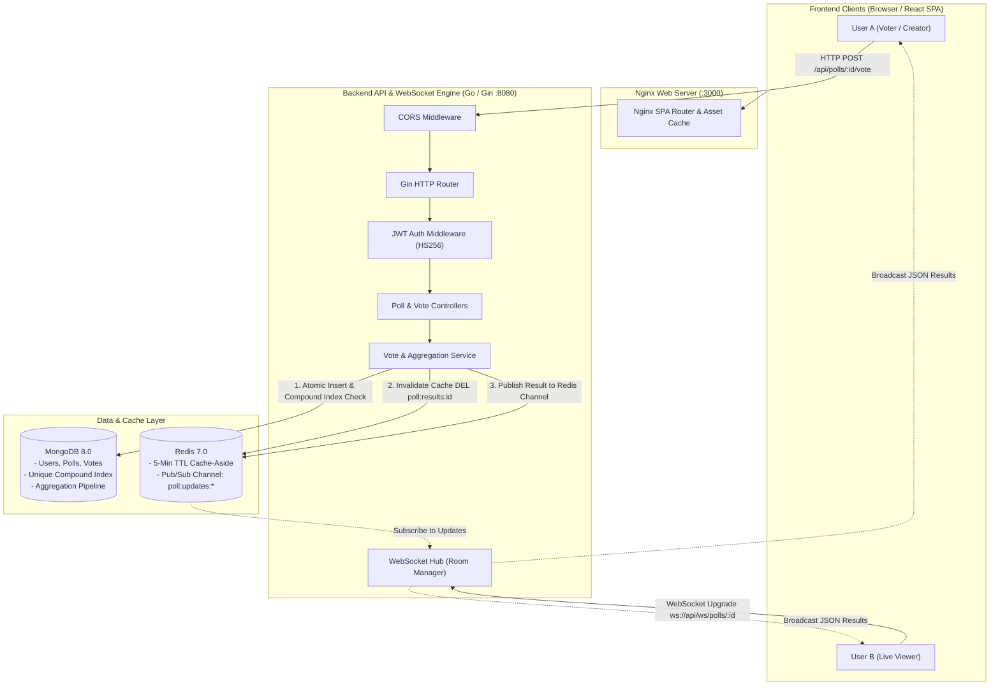
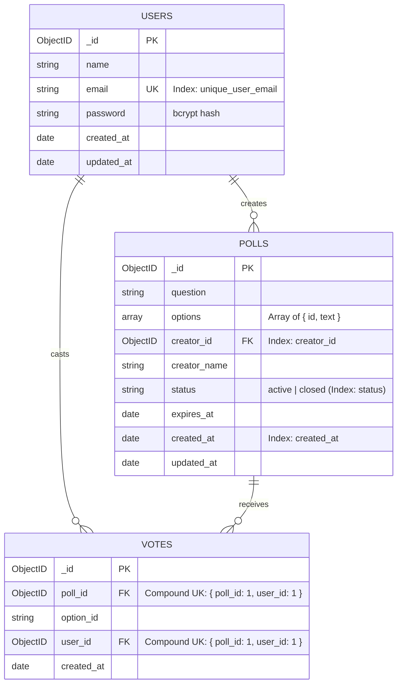

# ⚡ Live Polling Application

> A high-performance, enterprise-grade, real-time live polling and voting application built with **Go (Gin)**, **MongoDB**, **Redis (Cache-Aside & Pub/Sub)**, **WebSockets**, and **React (Vite + Tailwind CSS)**. Designed with clean layered architecture, distributed real-time synchronization, and production-grade container orchestration.

---

## 📑 Table of Contents
1. [System Architecture](#-system-architecture)
2. [Key Features](#-key-features)
3. [Technology Stack](#-technology-stack)
4. [Database Design & Indexing](#-database-design--indexing)
5. [Docker Compose & Microservices](#-docker-compose--microservices)
6. [Project Structure](#-project-structure)
7. [Getting Started](#-getting-started)
   - [Method 1: Running with Docker Compose (Recommended)](#method-1-running-with-docker-compose-recommended)
   - [Method 2: Running Locally from Source](#method-2-running-locally-from-source)
8. [API & WebSocket Documentation](#-api--websocket-documentation)
   - [Authentication Endpoints](#authentication-endpoints)
   - [Poll Management Endpoints](#poll-management-endpoints)
   - [Voting Endpoints](#voting-endpoints)
   - [WebSocket Real-Time Feed](#websocket-real-time-feed)
9. [Environment Configuration](#-environment-configuration)
10. [Automated Testing Suite](#-automated-testing-suite)
11. [System Design & Interview Q&A](#-system-design--interview-qa)

---

## 🏛 System Architecture

The application is structured into decoupled frontend and backend services communicating over REST APIs and WebSockets, backed by MongoDB for persistence and Redis for sub-millisecond caching and cross-instance Pub/Sub message distribution.



---

## ✨ Key Features

- **🔐 Robust Authentication & Security**:
  - Secure bcrypt password hashing ($2a$10$ work factor).
  - Stateless JWT authentication (HS256) with custom claims (`user_id`, `email`) and automatic expiration validation.
  - Strict resource ownership verification (only poll creators can update status or delete polls).

- **⚡ Real-Time Live Updates via WebSockets & Redis Pub/Sub**:
  - Instant live vote count and percentage updates pushed to all connected viewers without polling.
  - Horizontally scalable room manager: background goroutines subscribe to Redis Pub/Sub channels (`poll:updates:<id>`) to propagate updates across multiple backend nodes.
  - Client-side auto-reconnection with exponential backoff and ping/pong keep-alives.

- **🛡️ Concurrency-Safe Single-Vote Guarantee**:
  - Enforced at both the business logic layer and database engine level via MongoDB **unique compound index** on `{ poll_id: 1, user_id: 1 }`.
  - Prevents race conditions and double-voting even during concurrent requests.

- **🚀 Sub-Millisecond Aggregation & Redis Caching**:
  - High-throughput MongoDB aggregation pipeline computes vote counts and percentages dynamically.
  - Read-through (cache-aside) caching with a 5-minute TTL in Redis.
  - Instant cache invalidation triggered immediately when a new vote is successfully recorded.

- **🎨 Modern, Responsive React UI**:
  - Interactive vote options with animated percentage bars.
  - Dark/Light-inspired sleek modern aesthetic with Tailwind CSS and Lucide icons.
  - Dedicated pages: Home/Poll Feed, Create Poll, Poll Details with Live Results, User Profile, Login, and Registration.

---

## 🛠 Technology Stack

### Backend
| Technology | Description |
| :--- | :--- |
| **Go 1.24** | High-performance compiled systems language |
| **Gin Gonic** | Fast HTTP web framework with middleware pipeline |
| **MongoDB Go Driver v2** | Native NoSQL document database driver |
| **Go-Redis v9** | Modern Redis client with Pub/Sub support |
| **Gorilla WebSocket** | RFC 6455 compliant WebSocket implementation |
| **golang-jwt/jwt/v5** | Secure JSON Web Token library |
| **golang.org/x/crypto/bcrypt** | Password hashing standard |

### Frontend
| Technology | Description |
| :--- | :--- |
| **React 18** | Declarative component-based UI library |
| **Vite 6** | Ultra-fast build tool and development server |
| **Tailwind CSS 3** | Utility-first CSS framework |
| **React Router v6** | Client-side routing with protected route guards |
| **Axios** | HTTP client with automatic Bearer token interceptor |
| **Lucide React** | Modern iconography set |

### Infrastructure & DevOps
| Technology | Description |
| :--- | :--- |
| **Docker & Docker Compose** | Multi-container orchestration |
| **Nginx Alpine** | Lightweight production web server and SPA router |
| **MongoDB 8.0** | Document database with replication readiness |
| **Redis 7.0 Alpine** | In-memory cache and message broker |

---

## 🗄 Database Design & Indexing

### Collections & Indexes



### MongoDB Aggregation Pipeline for Results:
```javascript
db.votes.aggregate([
  { $match: { poll_id: ObjectId("...") } },
  { $group: { _id: "$option_id", count: { $sum: 1 } } }
])
```

---

## 🐳 Docker Compose & Microservices

The root [`docker-compose.yml`](docker-compose.yml) orchestrates 4 interconnected microservices on an isolated bridge network `live_poll_network`:

| Service | Container Name | Image / Build | Port Mapping | Healthcheck |
| :--- | :--- | :--- | :--- | :--- |
| **mongodb** | `guvi-mongodb` | `mongo:8` | `27017:27017` | `mongosh --eval "db.adminCommand('ping')"` |
| **redis** | `guvi-redis` | `redis:7-alpine` | `6379:6379` | `redis-cli ping` |
| **backend** | `guvi-backend` | `./backend/Dockerfile` | `8080:8080` | Depends on Mongo & Redis healthy |
| **frontend** | `guvi-frontend` | `./frontend/Dockerfile` | `3000:80` | Depends on Backend started |

---

## 📁 Project Structure

```
.
├── docker-compose.yml           # Multi-service orchestration (Backend, Frontend, Mongo, Redis)
├── .gitignore                   # Comprehensive repository gitignore
├── README.md                    # Project documentation & interview guide
│
├── backend/                     # Go Backend Service
│   ├── Dockerfile               # Multi-stage production build (Alpine runner)
│   ├── .dockerignore
│   ├── .env.example             # Backend environment template
│   ├── go.mod / go.sum          # Go module dependencies
│   ├── cmd/
│   │   └── api/
│   │       └── main.go          # Application entrypoint & graceful shutdown
│   └── internal/
│       ├── config/              # Environment & configuration loader
│       ├── database/            # MongoDB & Redis client connections
│       ├── handler/             # HTTP & WebSocket controllers + unit tests
│       ├── middleware/          # JWT Auth & CORS middlewares + unit tests
│       ├── model/               # Domain data structures & DTOs
│       ├── repository/          # Database persistence layer (Mongo queries)
│       ├── router/              # Gin route registration
│       ├── service/             # Business logic & caching + unit tests
│       └── websocket/           # WebSocket Client & Hub (Room Manager)
│
└── frontend/                    # React Frontend Application
    ├── Dockerfile               # Multi-stage production build (Nginx runner)
    ├── .dockerignore
    ├── nginx.conf               # Nginx SPA fallback & caching configuration
    ├── .env.example             # Frontend environment template
    ├── package.json             # NPM dependencies & scripts
    ├── index.html               # SPA root document
    ├── vite.config.js           # Vite build configuration
    ├── tailwind.config.js       # Tailwind CSS design system configuration
    └── src/
        ├── api/                 # Axios HTTP client with JWT injection
        ├── components/          # Reusable UI, Auth, and Poll components
        ├── context/             # Global AuthContext provider
        ├── hooks/               # usePollWebSocket & custom hooks
        ├── pages/               # Home, Login, Register, CreatePoll, PollDetail, Profile
        ├── services/            # API service calls (auth, poll, vote)
        ├── App.jsx              # Application router & routes
        └── main.jsx             # React DOM bootstrap
```

---

## 🚀 Getting Started

### Method 1: Running with Docker Compose (Recommended)

Start all 4 services with one single command:

```bash
# Clone repository
git clone https://github.com/your-username/live-polling-app.git
cd live-polling-app

# Launch entire stack
docker compose up --build -d
```

- **Frontend Application**: [`http://localhost:3000`](http://localhost:3000)
- **Backend API**: [`http://localhost:8080/api`](http://localhost:8080/api)
- **Health Endpoint**: [`http://localhost:8080/health`](http://localhost:8080/health)

To stop all services:
```bash
docker compose down
```

---

### Method 2: Running Locally from Source

#### 1. Start MongoDB and Redis
```bash
# Start databases using Docker
docker run -d --name local-mongo -p 27017:27017 mongo:8
docker run -d --name local-redis -p 6379:6379 redis:7-alpine
```

#### 2. Start Go Backend
```bash
cd backend
cp .env.example .env
go mod download
go run ./cmd/api
# Backend will start on http://localhost:8080
```

#### 3. Start React Frontend
```bash
cd frontend
cp .env.example .env
npm install
npm run dev
# Frontend will start on http://localhost:5173
```

---

## 📡 API & WebSocket Documentation

### Authentication Endpoints
| Method | Endpoint | Description | Auth Required |
| :--- | :--- | :--- | :--- |
| `POST` | `/api/auth/register` | Register new user account | No |
| `POST` | `/api/auth/login` | Login and obtain JWT token | No |
| `GET` | `/api/auth/me` | Fetch authenticated user's profile | **Yes (Bearer JWT)** |

### Poll Management Endpoints
| Method | Endpoint | Description | Auth Required |
| :--- | :--- | :--- | :--- |
| `GET` | `/api/polls` | List paginated polls (`?page=1&limit=10&status=active`) | No |
| `GET` | `/api/polls/:id` | Get poll details by ID | No |
| `POST` | `/api/polls` | Create a new poll with options | **Yes (Bearer JWT)** |
| `PUT` | `/api/polls/:id` | Update poll status / question (Owner only) | **Yes (Bearer JWT)** |
| `DELETE` | `/api/polls/:id` | Delete poll and related votes (Owner only) | **Yes (Bearer JWT)** |

### Voting Endpoints
| Method | Endpoint | Description | Auth Required |
| :--- | :--- | :--- | :--- |
| `POST` | `/api/polls/:id/vote` | Cast a single vote for an option | **Yes (Bearer JWT)** |
| `GET` | `/api/polls/:id/results` | Get aggregated vote results & percentages | No (Optional JWT) |

### WebSocket Real-Time Feed
| Protocol | Endpoint | Description |
| :--- | :--- | :--- |
| `WS` | `/api/ws/polls/:id` | Real-time WebSocket connection subscribing to poll updates |

#### Real-Time Update Payload (`POLL_UPDATE`):
```json
{
  "type": "POLL_UPDATE",
  "data": {
    "poll_id": "66e85293f0b001a1a1a1a1a1",
    "question": "What is your primary backend language?",
    "status": "active",
    "total_votes": 42,
    "results": [
      { "option_id": "opt-1", "text": "Go", "vote_count": 28, "percentage": 66.7 },
      { "option_id": "opt-2", "text": "Rust", "vote_count": 14, "percentage": 33.3 }
    ]
  }
}
```

---

## ⚙️ Environment Configuration

### Backend (`backend/.env`)
| Variable | Default Value | Description |
| :--- | :--- | :--- |
| `PORT` | `8080` | HTTP Server port |
| `APP_ENV` | `development` | Environment mode (`development` / `production`) |
| `GIN_MODE` | `debug` | Gin router mode (`debug` / `release` / `test`) |
| `MONGO_URI` | `mongodb://localhost:27017` | MongoDB connection URI |
| `MONGO_DB_NAME` | `polling_app` | MongoDB target database name |
| `JWT_SECRET` | `super_secret_jwt_key...` | HMAC-SHA256 signing secret |
| `JWT_EXPIRY_HOURS` | `24` | Token lifetime duration in hours |
| `REDIS_ADDR` | `localhost:6379` | Redis host & port |
| `REDIS_PASSWORD` | `""` | Optional Redis auth password |
| `REDIS_DB` | `0` | Redis logical DB index |
| `REDIS_ENABLED` | `true` | Toggle Redis caching & Pub/Sub |

### Frontend (`frontend/.env`)
| Variable | Default Value | Description |
| :--- | :--- | :--- |
| `VITE_API_BASE_URL` | `http://localhost:8080/api` | Base URL for REST API endpoints |
| `VITE_WS_BASE_URL` | `ws://localhost:8080/api/ws` | Base URL for WebSocket connections |

---

## 🧪 Automated Testing Suite

Run the full automated testing suite across services, middlewares, and HTTP handlers:

```bash
cd backend
go test -v ./...
```

### Verified Test Cases:
- ✅ `TestJWTService_GenerateAndValidateToken`: Validates token creation and claim parsing.
- ✅ `TestJWTService_InvalidTokenSignature`: Tests signature tampering protection.
- ✅ `TestJWTService_ExpiredToken`: Asserts automatic token expiration handling.
- ✅ `TestAuthMiddleware_MissingHeader`: Verifies 401 response on missing headers.
- ✅ `TestAuthMiddleware_ValidToken`: Verifies Gin context claim injection.
- ✅ `TestAuthHandler_Register_DuplicateEmail`: Tests 409 Conflict duplicate user handling.
- ✅ `TestVoteHandler_CastVote_AlreadyVoted`: Tests 409 Conflict on double-voting attempts.
- ✅ `TestVoteHandler_CastVote_ClosedPoll`: Asserts 400 Bad Request on closed polls.

---

## 💡 System Design & Interview Q&A

### 1. How do you prevent double-voting during high-concurrency race conditions?
> **Answer:** Double-voting prevention is enforced at two distinct layers:
> 1. **Application Layer**: Prior to writing a vote, the `VoteService` checks if a record with `{ poll_id, user_id }` already exists.
> 2. **Database Engine Layer**: In MongoDB, we created a **unique compound index** on `{ poll_id: 1, user_id: 1 }`. Even if two concurrent requests from the same user pass the application pre-check simultaneously, MongoDB's atomic index write guarantees that one insert succeeds and the second fails with duplicate key error `E11000`. The service detects this and returns an `ErrAlreadyVoted` (HTTP 409 Conflict).

### 2. How does Redis Pub/Sub solve the WebSocket multi-server scaling problem?
> **Answer:** If we scale the backend horizontally across multiple container replicas, Client A may be connected to Node 1 while Client B is connected to Node 2. When a vote is cast on Node 1, an in-memory broadcast would only notify clients on Node 1.
> By integrating **Redis Pub/Sub**, when Node 1 records a vote, it publishes a message to channel `poll:updates:<poll_id>`. All backend nodes subscribe to these channels. Node 2 receives the Redis message and immediately broadcasts the updated vote results to its local WebSocket clients.

### 3. How does the Cache-Aside pattern work for Poll Results?
> **Answer:**
> 1. **Read Path**: When a client requests `GET /api/polls/:id/results`, the service checks Redis key `poll:results:<id>`.
>    - If present (**Cache Hit**), results return in <1ms without querying MongoDB.
>    - If missing (**Cache Miss**), the service runs the MongoDB aggregation pipeline, caches the calculated result in Redis with a 5-minute TTL, and returns the response.
> 2. **Write Path (Invalidation)**: When a vote is cast (`POST /api/polls/:id/vote`), the service immediately issues `DEL poll:results:<id>` in Redis before publishing the real-time update. This ensures zero stale data while offloading heavy read traffic.

### 4. Why use Go and Gin for high-throughput live polling?
> **Answer:** Go's lightweight concurrency model (goroutines consuming only ~2KB of initial stack memory vs ~1MB for OS threads) allows a single backend node to handle tens of thousands of concurrent WebSocket connections and HTTP requests with minimal CPU and memory overhead. Gin provides a fast, zero-allocation radix tree router ideal for latency-critical APIs.

---

## 📜 License
This project is open source and available under the [MIT License](LICENSE).
