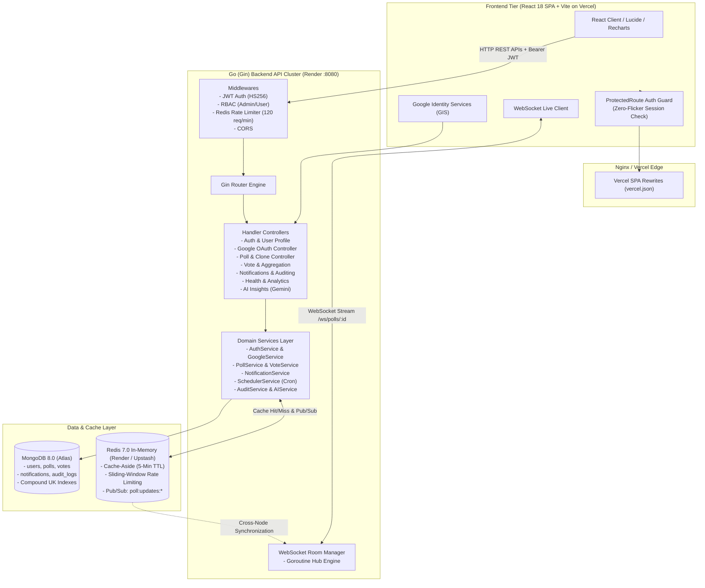

# 🌐 PollSphere — Enterprise Real-Time Polling & Analytics Platform

## 📖 Overview

**PollSphere** is a high-concurrency, enterprise-grade polling, voting, and real-time analytics platform. Engineered with a **Go (Gin Clean Architecture)** backend and a **React 18 (Vite + Tailwind CSS + Recharts)** frontend, PollSphere delivers sub-millisecond voting feedback, live multi-client WebSocket synchronization via Redis Pub/Sub, robust dual authentication (Strict Gmail validation & Google OAuth 2.0), automated poll expiration, and AI-driven poll insights.

---

## 📑 Table of Contents
1. [Key Features](#-key-features)
2. [System Architecture](#-system-architecture)
3. [Dual Authentication System](#-dual-authentication-system)
4. [Technology Stack](#-technology-stack)
5. [Database Design & MongoDB Indexes](#-database-design--mongodb-indexes)
6. [API & WebSocket Route Reference](#-api--websocket-route-reference)
7. [Frontend Routing & Access Control](#-frontend-routing--access-control)
8. [Environment Variables](#-environment-variables)
9. [Getting Started Locally](#-getting-started-locally)
10. [Cloud Deployment Guide](#-cloud-deployment-guide)
11. [Automated Testing](#-automated-testing)
12. [System Design Highlights](#-system-design-highlights)
13. [Author](#-author)

---

## 🌟 Key Features

| Feature | Description | Layer |
|---|---|---|
| **Google Sign-In (OAuth 2.0)** | One-click login via Google Identity Services (GIS) with generic button, auto-profile sync, and JWT exchange | Full Stack |
| **Strict Gmail Validation** | Enforces valid `username@gmail.com` on frontend & backend, rejecting typos or invalid domains | Security |
| **Real-Time WebSockets** | Instant live vote tally broadcasting across clients via Gorilla WebSockets | Backend + Frontend |
| **Redis Pub/Sub Scaling** | Horizontal WebSocket message synchronization across multi-instance backend nodes | Distributed Cache |
| **Zero Double-Voting** | Atomic uniqueness guaranteed by MongoDB compound index `{ poll_id: 1, user_id: 1 }` | Database Engine |
| **Interactive Analytics** | Real-time Recharts dashboards (Votes/Day, Category Distribution, Top Polls, Status metrics) | Frontend + Aggregations |
| **AI Poll Insights** | Automated poll outcome analysis & recommendations powered by Google Gemini API & heuristics | Go Service + React |
| **Poll Expiration Worker** | Background Go cron scheduler that auto-closes polls and notifies creators | Go Goroutine |
| **One-Click Poll Cloning** | Clone questions, choices, and settings to quickly spin up recurring surveys | Backend + Frontend |
| **Survey Templates** | 5 built-in presets (Tech Stack, Customer Feedback, Hackathon Voting, Team Standup, Sports) | Frontend UI |
| **Persistent Notification Center** | Real-time alerts for vote milestones, poll closings, and admin announcements | MongoDB + React |
| **Role-Based Access Control (RBAC)** | Granular `user` and `admin` roles, administrative moderation, and security audit logs | Gin Middleware |
| **Sliding-Window Rate Limiting** | Redis-powered rate limiter (120 req/min) preventing API abuse and DDoS | Gin Middleware |
| **Report Exporting & QR Code** | Export results to CSV/JSON and instant SVG QR code generation for mobile voting | React Utilities |

---

## 🏛 System Architecture

The application adheres to Go **Clean Architecture** principles, maintaining strict separation of concerns across handlers, services, repositories, models, and domain entities:



---

## 🔐 Dual Authentication System

PollSphere supports two secure, modern authentication pathways:

### 1. Google OAuth 2.0 (Google Identity Services)
* **Generic Button**: Clean `Continue with Google` interface without displaying personalized name/email directly on the page.
* **Token Verification**: Google ID Token (JWT) is sent to backend `POST /api/auth/google`, verified against Google's TokenInfo endpoint with audience check (`aud == GOOGLE_CLIENT_ID`).
* **Auto-Provisioning**: New users are provisioned with Google profile picture, name, verified email, and `auth_provider: "google"`. Existing users are seamlessly linked.
* **PollSphere JWT**: Returns a standard PollSphere Bearer JWT token with zero difference in session handling.

### 2. Strict Gmail Address + Password Authentication
* **Regex Format**: Only valid Gmail formats allowed (`^[a-zA-Z0-9._]+@gmail\.com$`).
* Rejects typos like `abc@gmail.commmmm`, `user@gmail.c`, and non-Gmail domains.
* Passwords hashed using industry-standard **bcrypt** (cost 10).

---

## 💻 Technology Stack

### Backend
* **Language**: Go 1.24
* **Web Framework**: Gin Web Framework (`github.com/gin-gonic/gin`)
* **Real-Time**: Gorilla WebSocket (`github.com/gorilla/websocket`)
* **Database Driver**: Official Go Mongo Driver (`go.mongodb.org/mongo-driver`)
* **Cache & Pub/Sub**: Go-Redis (`github.com/redis/go-redis/v9`)
* **Authentication**: JWT (`github.com/golang-jwt/jwt/v5`) + Bcrypt
* **AI Integration**: Google Generative AI (Gemini)
* **Validation**: Go Playground Validator

### Frontend
* **Core**: React 18 + Vite
* **Styling**: Tailwind CSS + Modern Glassmorphism + Dark Palette
* **Icons**: Lucide React
* **Charts**: Recharts (Bar, Pie, Line, Area charts)
* **Routing**: React Router v6
* **Notifications**: React Hot Toast + Persistent MongoDB Notification Center
* **Auth**: Google Identity Services SDK (`accounts.google.com/gsi/client`)

---

## 🗄 Database Design & MongoDB Indexes

| Collection | Schema Highlights | Indexes |
|---|---|---|
| `users` | `name`, `email`, `password`, `role`, `auth_provider`, `google_id`, `profile_image`, `created_at` | `email` (Unique), `google_id` (Sparse Unique) |
| `polls` | `title`, `description`, `creator_id`, `category`, `choices[]`, `status`, `expires_at`, `tags[]` | `creator_id`, `category`, `status`, `created_at` |
| `votes` | `poll_id`, `choice_id`, `user_id`, `created_at` | **`{ poll_id: 1, user_id: 1 }` (Compound Unique)** |
| `notifications` | `user_id`, `title`, `message`, `type`, `read`, `created_at` | `user_id`, `{ user_id: 1, read: 1 }` |
| `audit_logs` | `user_id`, `action`, `resource`, `resource_id`, `ip_address`, `timestamp` | `user_id`, `action`, `timestamp` |

> **Concurrency Safety**: The compound unique index on `{ poll_id: 1, user_id: 1 }` strictly rejects duplicate votes at the database engine level (Error `E11000`), guaranteeing zero double-voting under concurrent race conditions.

---

## 📡 API & WebSocket Route Reference

### Authentication
* `POST /api/auth/register` — Register with name, valid Gmail address, and password
* `POST /api/auth/login` — Sign in with Gmail address and password
* `POST /api/auth/google` — Authenticate via Google ID token (returns JWT & user profile)
* `GET /api/auth/me` — Retrieve current authenticated user profile

### Polls & Voting
* `GET /api/polls` — List active public polls with pagination, search, and category filters
* `POST /api/polls` — Create a new poll *(Protected)*
* `GET /api/polls/:id` — Fetch poll details and choices
* `PUT /api/polls/:id` — Update poll title/description/expiry *(Creator/Admin)*
* `DELETE /api/polls/:id` — Delete poll and associated votes *(Creator/Admin)*
* `POST /api/polls/:id/vote` — Cast a vote on a specific choice *(Protected)*
* `GET /api/polls/:id/results` — Fetch aggregated results (cached in Redis)
* `POST /api/polls/:id/clone` — Duplicate an existing poll *(Protected)*
* `GET /api/polls/:id/insights` — Generate AI/statistical insights for poll results

### Real-Time WebSocket
* `GET /api/ws/polls/:id` — Upgrade connection to WebSocket stream for live vote updates

### Analytics & User Profile
* `GET /api/analytics/overview` — Platform statistics (total polls, votes, active users)
* `GET /api/users/my-polls` — List polls created by the logged-in user *(Protected)*
* `GET /api/users/timeline` — Fetch chronological activity timeline *(Protected)*
* `GET /api/users/leaderboard` — Top poll creators and community rankings

### Notifications & System
* `GET /api/notifications` — Fetch user notifications *(Protected)*
* `PATCH /api/notifications/:id/read` — Mark notification as read *(Protected)*
* `DELETE /api/notifications/:id` — Remove notification *(Protected)*
* `GET /health` — Health check endpoint (MongoDB, Redis, and server status)

---

## 🧭 Frontend Routing & Access Control

| Route | Component | Access Level | Description |
|---|---|---|---|
| `/` | `Home.jsx` | Public | SaaS Landing page with hero, live preview, and features |
| `/login` | `Login.jsx` | Public | Email & Google sign-in with redirect target preservation |
| `/register` | `Register.jsx` | Public | Account creation with strict Gmail verification |
| `/explore` | `Explore.jsx` | Public | Browse public community polls |
| `/polls/:id` | `PollDetails.jsx` | Public | View poll details, cast vote, and watch live results |
| `/dashboard` | `Dashboard.jsx` | Protected | User hub, recent activity, quick actions |
| `/create-poll` | `CreatePoll.jsx` | Protected | Poll creator with choices, timer, category, and templates |
| `/my-polls` | `MyPolls.jsx` | Protected | Management dashboard for user's created polls |
| `/analytics` | `AnalyticsDashboard.jsx` | Protected | Visual data analytics with interactive Recharts |
| `/leaderboard` | `Leaderboard.jsx` | Protected | Community engagement leaderboard |
| `/profile` | `Profile.jsx` | Protected | User profile, Google account status, activity timeline |
| `/admin` | `AdminPortal.jsx` | Admin | Administrative moderation, user management, audit logs |

---

## ⚙️ Environment Variables

### Frontend (`frontend/.env`)
```env
# Backend API base URL
VITE_API_BASE_URL=https://<your-render-backend>.onrender.com/api

# WebSocket base URL
VITE_WS_BASE_URL=wss://<your-render-backend>.onrender.com/api/ws

# Google OAuth 2.0 Client ID (public identifier)
VITE_GOOGLE_CLIENT_ID=your_google_client_id.apps.googleusercontent.com
```

### Backend (`backend/.env`)
```env
# Server Port
PORT=8080
GIN_MODE=release

# MongoDB Connection URI
MONGO_URI=mongodb+srv://<username>:<password>@cluster0.mongodb.net/pollsphere?retryWrites=true&w=majority
MONGO_DB=pollsphere

# Redis Connection URI
REDIS_URL=rediss://default:<password>@<your-redis-host>:6379

# JWT Secret Key
JWT_SECRET=your_super_secret_jwt_key_here
JWT_EXPIRY_HOURS=72

# Google OAuth 2.0 Credentials (Backend only)
GOOGLE_CLIENT_ID=your_google_client_id.apps.googleusercontent.com
GOOGLE_CLIENT_SECRET=your_google_client_secret

# AI Insights (Optional)
GEMINI_API_KEY=your_gemini_api_key_here
```

> [!CAUTION]
> Never commit `GOOGLE_CLIENT_SECRET` or `JWT_SECRET` to Git or public repositories. The client secret must **only** be configured as an environment variable in your backend hosting platform (e.g. Render).

---

## 🚀 Getting Started Locally

### Prerequisites
* **Go 1.24+**: [Download Go](https://go.dev/dl/)
* **Node.js 18+ & npm**: [Download Node](https://nodejs.org/)
* **MongoDB**: Local MongoDB instance or free [MongoDB Atlas](https://www.mongodb.com/atlas) cluster
* **Redis**: Local Redis or free [Upstash Redis](https://upstash.com/) instance

### 1. Clone the Repository
```bash
git clone https://github.com/srinagapriya06122006/PollSphere-.git
cd PollSphere-
```

### 2. Run the Backend
```bash
cd backend
cp .env.example .env
# Update .env with your MongoDB URI, Redis URL, and Google Client ID
go mod download
go run ./cmd/api/main.go
```
The Go backend will start on `http://localhost:8080`.

### 3. Run the Frontend
```bash
cd ../frontend
cp .env.example .env
# Ensure VITE_API_BASE_URL=http://localhost:8080/api and VITE_GOOGLE_CLIENT_ID are set
npm install
npm run dev
```
Open `http://localhost:5173` in your browser.

---

## ☁️ Cloud Deployment Guide

```
Google Cloud (OAuth)
       │
       ▼
Vercel (Frontend SPA)
VITE_GOOGLE_CLIENT_ID
VITE_API_BASE_URL
       │
       ▼
Render (Backend API Cluster)
GOOGLE_CLIENT_ID
GOOGLE_CLIENT_SECRET
MONGO_URI / REDIS_URL
       │
       ▼
MongoDB Atlas & Redis
```

### 1. Google Cloud Console
1. Create a project in [Google Cloud Console](https://console.cloud.google.com/).
2. Navigate to **APIs & Services** > **Credentials** > **OAuth 2.0 Client IDs**.
3. Under **Authorized JavaScript origins**, add:
   - `http://localhost:5173` (for local development)
   - `https://poll-sphere-beta.vercel.app` (your Vercel production domain)
4. Copy your **Client ID** (for frontend & backend) and **Client Secret** (for backend only).

### 2. Frontend on Vercel
1. Connect repository on [Vercel](https://vercel.com).
2. Set Root Directory: `frontend`.
3. Add Environment Variables:
   - `VITE_API_BASE_URL` = `https://<your-backend>.onrender.com/api`
   - `VITE_WS_BASE_URL` = `wss://<your-backend>.onrender.com/api/ws`
   - `VITE_GOOGLE_CLIENT_ID` = `your_google_client_id.apps.googleusercontent.com`
4. Deploy! All SPA routes are automatically handled by `vercel.json`.

### 3. Backend on Render
1. Create a **Web Service** on [Render](https://render.com).
2. Root Directory: `backend`.
3. Build Command: `go build -o server ./cmd/api/main.go`.
4. Start Command: `./server`.
5. Add Environment Variables: `MONGO_URI`, `MONGO_DB`, `REDIS_URL`, `JWT_SECRET`, `GOOGLE_CLIENT_ID`, `GOOGLE_CLIENT_SECRET`.

---

## 📋 Internship Requirements & Verification Audit

| Requirement | Status | Evidence / Implementation File | Audit Notes & Actions |
|-------------|--------|-------------------------------|-----------------------|
| **React Frontend** | ✅ PASS | `frontend/src/App.jsx`, `frontend/src/routes/AppRoutes.jsx`, `frontend/package.json` | React 18 SPA with modular component hierarchy, Vite build system, Tailwind CSS design system, and Recharts analytics. |
| **Go + Gin Backend** | ✅ PASS | `backend/cmd/api/main.go`, `backend/internal/router/router.go`, `backend/internal/handler/` | Gin Clean Architecture with structured handlers, domain services, custom middlewares, and graceful shutdown. |
| **MongoDB Database** | ✅ PASS | `backend/internal/database/mongodb.go`, `backend/internal/repository/` | MongoDB 8.0 official Go driver (`v2`), atomic compound unique indexes on `{poll_id, user_id}`, aggregation pipelines. |
| **Redis Realtime** | ✅ PASS | `backend/internal/database/redis.go`, `backend/internal/websocket/hub.go`, `backend/internal/service/vote_service.go` | Genuine Redis Pub/Sub (`poll:updates:*`) horizontal sync + Cache-Aside (5-min TTL) with automatic invalidation on votes. |
| **Create Poll** | ✅ PASS | `frontend/src/pages/CreatePoll.jsx`, `backend/internal/handler/poll.go`, `backend/internal/service/poll_service.go` | Form validation (min 2 options, question length, categories, optional expiry timer, preset templates). Requires valid JWT. |
| **Share Poll** | ✅ PASS | `frontend/src/pages/PollDetails.jsx` (`handleCopyLink`, `QRCodeModal.jsx`) | One-click clipboard link sharing and instant SVG QR code generation for mobile devices. Direct URL access. |
| **Audience Voting** | ✅ PASS | `frontend/src/pages/PollDetails.jsx`, `backend/internal/handler/vote.go`, `backend/internal/service/vote_service.go` | Publicly accessible poll view with sign-in preservation (`?redirect=/polls/:id`). Validated and persisted in MongoDB. |
| **Live Results** | ✅ PASS | `frontend/src/hooks/usePollWebSocket.js`, `backend/internal/websocket/hub.go` | Real-time WebSocket broadcasting upon vote ingestion. Zero page refresh required. Automatic reconnection fallback. |
| **Authentication** | ✅ PASS | `backend/internal/service/auth_service.go`, `frontend/src/context/AuthContext.jsx` | Dual authentication: Strict Gmail address validation + Google OAuth 2.0 (GIS). HS256 JWT tokens. |
| **Backend Validation** | ✅ PASS | `backend/internal/handler/`, `backend/internal/model/` | Server-side validation on all endpoints: duplicate voting, poll closure, payload constraints, strict email regex. |
| **Separation of Concerns** | ✅ PASS | `backend/internal/` (handlers, services, repositories, models) | Clean Architecture; database logic never leaks to UI; WebSocket hub cleanly isolated from HTTP handlers. |
| **Security** | ✅ PASS | `backend/internal/middleware/`, `.gitignore`, `backend/internal/service/jwt_service.go` | Bcrypt hashing (cost 10), CORS restrictions, sliding-window rate limiting (120 req/min), `.env` protected in `.gitignore`. |
| **Deployment** | ✅ PASS | `vercel.json`, `backend/Dockerfile`, `frontend/Dockerfile`, `docker-compose.yml` | Live frontend deployed on Vercel; Docker multi-stage builds ready for production containers. |
| **UI/UX** | ✅ PASS | `frontend/src/components/`, `frontend/src/pages/` | Modern responsive dark/light mode SaaS design, custom typography, glassmorphism, skeleton loading states, empty states. |
| **README** | ✅ PASS | `README.md` | Complete architecture diagram, dual auth breakdown, API references, database schemas, local setup, and cloud guides. |
| **Submission Video** | ⏳ READY | 3–5 min video (Presentation script prepared in audit documentation) | Record workflow: Create poll → Share link → Audience votes → Real-time result update. |

---

## 🧪 Automated Testing


Execute the Go test suite across handlers, services, middlewares, and models:

```bash
cd backend
go test -v ./...
```

Verified Test Coverage:
- ✅ **Token Management**: Creation, HMAC-SHA256 signature verification, and expiration handling.
- ✅ **Middleware Security**: Bearer header validation, malformed token rejection, and role-based permissions.
- ✅ **Validation Guardrails**: Duplicate email prevention, strict Gmail format validation.
- ✅ **Concurrency Safety**: Double-voting rejection and closed poll voting prevention.

---

## 💡 System Design Highlights

1. **Atomic Concurrency Control**: Double-voting is prevented at both the service layer and database engine layer using a compound unique index `{ poll_id: 1, user_id: 1 }`.
2. **Distributed WebSocket Scaling**: Multiple Go backend nodes communicate via Redis Pub/Sub channels (`poll:updates:<poll_id>`), allowing users connected to different servers to receive real-time vote updates instantaneously.
3. **Cache-Aside Result Acceleration**: Poll results are cached in Redis with a 5-minute TTL. Casting a vote immediately invalidates the cache (`DEL poll:results:<id>`), ensuring subsequent reads always reflect the latest tallies.
4. **Background Cron Expiration**: A dedicated Go background goroutine monitors expiring polls, transitions their status to `closed`, invalidates caches, notifies authors, and broadcasts `POLL_EXPIRED` to all active viewers.

---

## 👤 Author

**Srinagapriya**  
* GitHub: [@srinagapriya06122006](https://github.com/srinagapriya06122006)  
* Project: [PollSphere-](https://github.com/srinagapriya06122006/PollSphere-)

---Yes. Your current README has good technical depth, but it looks **too enterprise-heavy and slightly overclaimed** in places. For a GitHub internship/project submission, I would make it more professional, easier to scan, and focused on **what PollSphere actually does**.

Below is a polished version you can directly use as `README.md`.

````markdown
# 🌐 PollSphere — Real-Time Polling & Analytics Platform

> Create polls, share them with your audience, collect votes, and watch results update in real time — without refreshing the page.

PollSphere is a full-stack real-time polling platform built with **React, Go, MongoDB, Redis, and WebSockets**.

The platform allows authenticated users to create and manage polls while participants can access shared polls, vote, and view live results. Redis Pub/Sub and WebSockets power real-time synchronization across connected clients.

---

## 🚀 Live Demo

**Frontend:**  
https://poll-sphere-beta.vercel.app/

**Backend API:**  
https://pollsphere-py5v.onrender.com

**GitHub Repository:**  
https://github.com/srinagapriya06122006/PollSphere-

---

## ✨ Features

### 📊 Poll Management
- Create polls with multiple choices
- Add descriptions and categories
- Configure poll expiration
- Edit and delete polls
- Clone existing polls
- Manage created polls from a dedicated dashboard

### ⚡ Real-Time Voting
- Vote on active polls
- Live result updates without page refresh
- WebSocket-based communication
- Redis Pub/Sub for real-time event distribution
- Automatic WebSocket reconnection

### 🔐 Authentication & Security
- Email/password authentication
- Strict Gmail address validation
- Google Sign-In using Google Identity Services
- JWT-based authentication
- Password hashing with bcrypt
- Protected routes
- Role-based access control
- API rate limiting
- CORS protection
- Backend request validation

### 📈 Analytics
- Vote statistics
- Poll performance metrics
- Category distribution
- Interactive charts using Recharts
- Poll result visualization
- CSV/JSON result export

### 📱 Poll Sharing
- Shareable poll URLs
- Copy poll link
- QR code generation
- Mobile-friendly voting experience

### 🔔 Notifications
- Poll activity notifications
- Vote milestone notifications
- Poll expiration notifications
- Persistent notification center

### 🤖 AI Poll Insights
- AI-assisted poll result analysis
- Statistical insights
- Automated recommendations
- Google Gemini integration

---

# 🏗️ System Architecture

```mermaid
flowchart TD

    User["User / Browser"]

    subgraph Frontend["Frontend - React + Vite"]
        UI["React UI"]
        Auth["Authentication"]
        PollUI["Poll & Voting UI"]
        Analytics["Analytics Dashboard"]
        WSClient["WebSocket Client"]
    end

    subgraph Backend["Backend - Go + Gin"]
        Router["Gin Router"]
        Middleware["Auth / Validation / Rate Limiting"]
        Handler["HTTP Handlers"]
        Service["Business Services"]
        WebSocket["WebSocket Hub"]
    end

    subgraph Data["Data Layer"]
        Mongo[("MongoDB")]
        Redis[("Redis")]
    end

    User --> Frontend

    Frontend --> Router
    UI --> Auth
    UI --> PollUI
    UI --> Analytics
    PollUI --> WSClient

    Router --> Middleware
    Middleware --> Handler
    Handler --> Service

    Service --> Mongo
    Service --> Redis

    WSClient <--> WebSocket
    WebSocket <--> Redis
````

---

# ⚙️ How PollSphere Works

```text
Create Poll
     ↓
Poll Stored in MongoDB
     ↓
Share Poll Link / QR Code
     ↓
Audience Opens Poll
     ↓
User Votes
     ↓
Backend Validates Vote
     ↓
Vote Stored in MongoDB
     ↓
Redis Pub/Sub Broadcast
     ↓
WebSocket Sends Update
     ↓
Connected Clients See New Results
```

No manual page refresh is required to see updated results.

---

# 🧩 Technology Stack

## Frontend

| Technology               | Purpose               |
| ------------------------ | --------------------- |
| React 18                 | User interface        |
| Vite                     | Frontend build tool   |
| Tailwind CSS             | Styling               |
| React Router             | Client-side routing   |
| Axios                    | API communication     |
| Recharts                 | Data visualization    |
| Lucide React             | Icons                 |
| React Hot Toast          | Notifications         |
| Google Identity Services | Google authentication |

## Backend

| Technology        | Purpose                            |
| ----------------- | ---------------------------------- |
| Go                | Backend language                   |
| Gin               | HTTP framework                     |
| Gorilla WebSocket | Real-time communication            |
| MongoDB Go Driver | Database access                    |
| Redis             | Pub/Sub, caching and rate limiting |
| JWT               | Authentication                     |
| bcrypt            | Password hashing                   |
| Google Gemini     | AI insights                        |

## Infrastructure

| Technology    | Purpose                         |
| ------------- | ------------------------------- |
| Vercel        | Frontend deployment             |
| Render        | Backend deployment              |
| MongoDB Atlas | Cloud database                  |
| Redis         | Real-time messaging and caching |
| Docker        | Containerization                |
| GitHub        | Source control                  |

---

# 🔐 Authentication

PollSphere provides two authentication methods.

## 1. Email & Password

Users can register using a valid Gmail address.

The backend validates the email format before creating the account.

Passwords are securely hashed using bcrypt before storage.

```text
User Registration
       ↓
Gmail Validation
       ↓
Password Hashing
       ↓
MongoDB
       ↓
JWT Authentication
```

## 2. Google Sign-In

PollSphere also supports Google Sign-In using Google Identity Services.

```text
Google Sign-In
      ↓
Google ID Token
      ↓
Backend Verification
      ↓
User Account Creation / Login
      ↓
PollSphere JWT
```

---

# ⚡ Real-Time Architecture

Real-time communication is one of the core features of PollSphere.

When a user votes:

```text
User Vote
   ↓
Go API
   ↓
Vote Validation
   ↓
MongoDB
   ↓
Redis Pub/Sub
   ↓
WebSocket Hub
   ↓
Connected Browsers
```

This allows multiple users viewing the same poll to receive updated results without refreshing the page.

### Technologies involved

* Go WebSocket Hub
* Gorilla WebSocket
* Redis Pub/Sub
* MongoDB
* React WebSocket client

---

# 🗄️ Database Design

PollSphere uses MongoDB for persistent application data.

### Main Collections

| Collection      | Purpose                                      |
| --------------- | -------------------------------------------- |
| `users`         | User accounts and authentication information |
| `polls`         | Poll questions, choices and settings         |
| `votes`         | User voting records                          |
| `notifications` | User notifications                           |
| `audit_logs`    | Security and administrative activity         |

### Duplicate Vote Protection

Votes use a compound unique index:

```text
{ poll_id: 1, user_id: 1 }
```

This prevents the same authenticated user from voting multiple times on the same poll at the database level.

---

# 📡 API Overview

## Authentication

```text
POST /api/auth/register
POST /api/auth/login
POST /api/auth/google
GET  /api/auth/me
```

## Polls

```text
GET    /api/polls
POST   /api/polls
GET    /api/polls/:id
PUT    /api/polls/:id
DELETE /api/polls/:id
POST   /api/polls/:id/clone
```

## Voting

```text
POST /api/polls/:id/vote
GET  /api/polls/:id/results
```

## AI Insights

```text
GET /api/polls/:id/insights
```

## Analytics

```text
GET /api/analytics/overview
```

## Notifications

```text
GET    /api/notifications
PATCH  /api/notifications/:id/read
DELETE /api/notifications/:id
```

## WebSocket

```text
GET /api/ws/polls/:id
```

## Health Check

```text
GET /health
```

---

# 🧭 Frontend Routes

| Route          | Access    | Purpose                 |
| -------------- | --------- | ----------------------- |
| `/`            | Public    | Landing page            |
| `/login`       | Public    | User login              |
| `/register`    | Public    | User registration       |
| `/explore`     | Public    | Browse community polls  |
| `/polls/:id`   | Public    | View and vote on a poll |
| `/dashboard`   | Protected | User dashboard          |
| `/create-poll` | Protected | Create a poll           |
| `/my-polls`    | Protected | Manage created polls    |
| `/analytics`   | Protected | View analytics          |
| `/leaderboard` | Protected | Community leaderboard   |
| `/profile`     | Protected | User profile            |
| `/admin`       | Admin     | Administration          |

---

# 🛡️ Security

PollSphere implements several security measures:

* JWT-based authentication
* bcrypt password hashing
* Strict Gmail validation
* Backend input validation
* Protected API routes
* Role-based authorization
* Redis-based rate limiting
* CORS configuration
* Duplicate vote protection
* Environment variable based secrets
* Google ID token verification

> **Important:** Never commit `.env` files, JWT secrets, Google client secrets, database credentials, or API keys to GitHub.

---

# 📁 Project Structure

```text
PollSphere-
│
├── frontend/
│   ├── src/
│   │   ├── components/
│   │   ├── context/
│   │   ├── hooks/
│   │   ├── pages/
│   │   ├── routes/
│   │   └── services/
│   ├── public/
│   ├── package.json
│   └── vite.config.js
│
├── backend/
│   ├── cmd/
│   │   └── api/
│   ├── internal/
│   │   ├── handler/
│   │   ├── service/
│   │   ├── repository/
│   │   ├── model/
│   │   ├── middleware/
│   │   ├── database/
│   │   └── websocket/
│   ├── Dockerfile
│   ├── go.mod
│   └── go.sum
│
├── docker-compose.yml
├── vercel.json
├── README.md
└── .gitignore
```

---

# 💻 Getting Started

## Prerequisites

Make sure you have:

* Git
* Node.js 18+
* npm
* Go 1.24+
* MongoDB
* Redis

Cloud alternatives such as MongoDB Atlas and Redis hosting can also be used.

---

## 1. Clone the Repository

```bash
git clone https://github.com/srinagapriya06122006/PollSphere-.git

cd PollSphere-
```

---

## 2. Configure Backend

```bash
cd backend
```

Create a `.env` file:

```env
PORT=8080
GIN_MODE=release

MONGO_URI=your_mongodb_connection_string
MONGO_DB=pollsphere

REDIS_URL=your_redis_connection_string

JWT_SECRET=your_jwt_secret
JWT_EXPIRY_HOURS=72

GOOGLE_CLIENT_ID=your_google_client_id
GOOGLE_CLIENT_SECRET=your_google_client_secret

GEMINI_API_KEY=your_gemini_api_key
```

Install dependencies:

```bash
go mod download
```

Start the backend:

```bash
go run ./cmd/api/main.go
```

Backend:

```text
http://localhost:8080
```

---

# 🎨 3. Configure Frontend

Open another terminal:

```bash
cd frontend
```

Create `.env`:

```env
VITE_API_BASE_URL=http://localhost:8080/api
VITE_WS_BASE_URL=ws://localhost:8080/api/ws
VITE_GOOGLE_CLIENT_ID=your_google_client_id
```

Install dependencies:

```bash
npm install
```

Start the development server:

```bash
npm run dev
```

Open:

```text
http://localhost:5173
```

---

# 🐳 Docker

PollSphere also includes Docker configuration for local infrastructure and deployment.

Start services using:

```bash
docker compose up -d
```

Check running containers:

```bash
docker ps
```

Stop services:

```bash
docker compose down
```

---

# ☁️ Deployment

## Frontend

The React application is deployed using **Vercel**.

Production frontend:

```text
https://poll-sphere-beta.vercel.app/
```

## Backend

The Go API is deployed using **Render**.

Production backend:

```text
https://pollsphere-py5v.onrender.com
```

## Database

MongoDB Atlas is used for cloud database storage.

## Real-Time Infrastructure

Redis is used for:

* Pub/Sub
* Result caching
* Rate limiting
* Real-time event distribution

---

# 🧪 Testing

Run the backend test suite:

```bash
cd backend
go test ./...
```

Verbose mode:

```bash
go test -v ./...
```

Testing areas include:

* Authentication
* JWT handling
* Request validation
* Middleware
* Duplicate voting protection
* Poll status validation
* Authorization

---

# 📋 Internship Requirement Coverage

| Requirement        | Implementation                          |
| ------------------ | --------------------------------------- |
| React Frontend     | React + Vite                            |
| Go Backend         | Go + Gin                                |
| MongoDB            | MongoDB Atlas                           |
| Redis              | Redis Pub/Sub + caching + rate limiting |
| Create Poll        | Protected poll creation                 |
| Share Poll         | Shareable URL + QR code                 |
| Audience Voting    | Poll voting system                      |
| Live Results       | WebSockets + Redis Pub/Sub              |
| Authentication     | JWT + Google Sign-In                    |
| Backend Validation | Server-side validation                  |
| Security           | JWT, bcrypt, rate limiting, CORS        |
| Deployment         | Vercel + Render                         |
| Responsive UI      | React + Tailwind CSS                    |

---

# 🎯 Core User Flow

```text
Register / Login
       ↓
Create Poll
       ↓
Publish Poll
       ↓
Share Poll Link / QR
       ↓
Audience Opens Poll
       ↓
Audience Votes
       ↓
Vote Stored in MongoDB
       ↓
Redis Pub/Sub
       ↓
WebSocket Broadcast
       ↓
Live Results Update
```

---

# 🧠 Key Technical Highlights

### 1. Real-Time Communication

Redis Pub/Sub and WebSockets allow vote updates to be distributed to connected clients without requiring page refreshes.

### 2. Duplicate Vote Protection

A MongoDB compound unique index prevents duplicate votes for the same user and poll.

### 3. Clean Architecture

The Go backend separates:

```text
Handlers
   ↓
Services
   ↓
Repositories
   ↓
Database
```

This keeps business logic independent from HTTP and database implementation details.

### 4. Protected Routes

Authentication middleware validates JWT tokens before allowing access to protected resources.

### 5. Responsive UI

The frontend is designed to work across:

* Desktop
* Tablet
* Mobile

---

# 📸 Application Preview

Add screenshots or GIFs here to showcase:

* Landing page
* Login / Google Sign-In
* Create Poll
* Poll Voting
* Live Results
* Analytics Dashboard

Example:

```markdown


```

---

# 🎥 Project Demonstration

The project demonstration covers:

1. Authentication
2. Poll creation
3. Poll sharing
4. Audience voting
5. Real-time result updates
6. Redis Pub/Sub and WebSocket architecture
7. Security and validation
8. Additional platform features

---

# 👩‍💻 Author

## Srinagapriya A

**B.E. Computer Science and Engineering**

### Links

* GitHub: [https://github.com/srinagapriya06122006](https://github.com/srinagapriya06122006)
* Project Repository: [https://github.com/srinagapriya06122006/PollSphere-](https://github.com/srinagapriya06122006/PollSphere-)

---

# 📄 License

This project is licensed under the MIT License.

---

<p align="center">
  Built with React, Go, MongoDB, Redis and WebSockets
</p>
```

### Important changes I made

Your original README is technically detailed, but I changed a few things intentionally:

* Removed the phrase **“sub-millisecond voting feedback”** because that is a performance claim you should only make if you have benchmark evidence.
* Changed **“enterprise-grade”** to a professional project description rather than making an unsupported enterprise claim.
* Removed overly complicated architecture wording where it didn't help a reviewer.
* Added **Live Demo** at the top so a recruiter can immediately open the project.
* Added a clear **Core User Flow**, which directly demonstrates the internship requirement.
* Added a clean **Internship Requirement Coverage** table.
* Added **Project Structure**.
* Added a dedicated **Application Preview** section where you can place screenshots.
* Kept the important technical details: **Go, Gin, React, MongoDB, Redis, WebSockets, JWT, bcrypt, Google Sign-In, AI insights**.
* Kept the README focused on what an interviewer needs to understand quickly.

Your GitHub README should look like a **professional software project**, not like a technical audit report.


## 📜 License

This project is licensed under the [MIT License](LICENSE).
