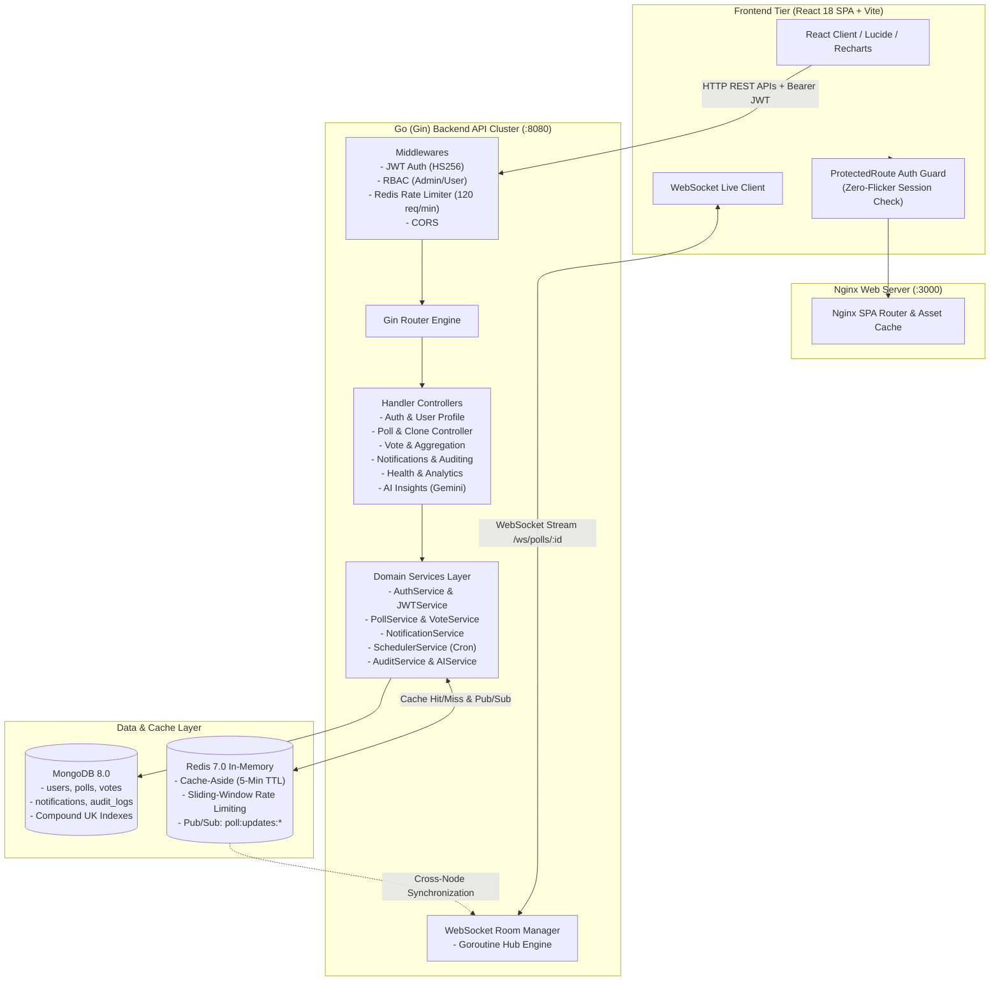
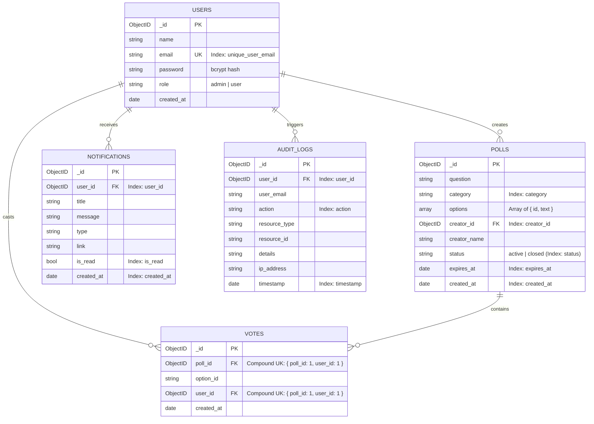

# ⚡ Live Polling Application — Enterprise Real-Time Platform

> A high-performance, enterprise-grade, real-time live polling and analytics application built with **Go 1.24 (Gin Clean Architecture)**, **MongoDB 8.0**, **Redis 7.0 (Cache-Aside, Sliding-Window Rate Limiting & Pub/Sub)**, **WebSockets (Gorilla)**, and **React 18 (Vite + Tailwind CSS + Recharts)**.

---

## 📑 Table of Contents
1. [System Architecture & Clean Design](#-system-architecture--clean-design)
2. [What Has Been Built (Placement-Focused Features)](#-what-has-been-built-placement-focused-features)
3. [Key Architecture Modules](#-key-architecture-modules)
   - [1. Real-Time WebSocket & Redis Pub/Sub Synchronization](#1-real-time-websocket--redis-pubsub-synchronization)
   - [2. Production SaaS Landing Page & Navigation Design](#2-production-saas-landing-page--navigation-design)
   - [3. Critical Route Protection & Authentication Architecture (`<ProtectedRoute />`)](#3-critical-route-protection--authentication-architecture-protectedroute-)
   - [4. Analytics & Interactive Visual Dashboard (Recharts)](#4-analytics--interactive-visual-dashboard-recharts)
   - [5. Persistent Notification Center](#5-persistent-notification-center)
   - [6. Background Poll Expiry Scheduler](#6-background-poll-expiry-scheduler)
   - [7. Role-Based Access Control (RBAC) & Audit Logs](#7-role-based-access-control-rbac--audit-logs)
   - [8. AI Poll Insights Engine (Gemini + Heuristic Fallback)](#8-ai-poll-insights-engine-gemini--heuristic-fallback)
   - [9. Enterprise Health Monitoring & Telemetry](#9-enterprise-health-monitoring--telemetry)
   - [10. Poll Cloning & Reusable Poll Templates](#10-poll-cloning--reusable-poll-templates)
   - [11. Export Reports & Dynamic QR Sharing](#11-export-reports--dynamic-qr-sharing)
4. [Technology Stack](#-technology-stack)
5. [Database Design & MongoDB Indexes](#-database-design--mongodb-indexes)
6. [API & WebSocket Route Reference](#-api--websocket-route-reference)
7. [Frontend Routing & Access Control Matrix](#-frontend-routing--access-control-matrix)
8. [Docker Compose & Microservices (Container Commands)](#-docker-compose--microservices)
9. [Getting Started Locally](#-getting-started-locally)
10. [Automated Testing Suite](#-automated-testing-suite)
11. [System Design & Interview Q&A](#-system-design--interview-qa)

---

## 🏛 System Architecture & Clean Design

The application adheres to Go **Clean Architecture** principles, maintaining strict separation of concerns across handlers, services, repositories, models, and domain entities:



---

## 🌟 What Has Been Built (Placement-Focused Features)

| Feature | Implementation Highlights | Layer |
|---|---|---|
| **Production SaaS Landing Page** | Streamlined wide desktop layout (`max-w-[1500px]`) with static hero preview, core capabilities, 3-step guide, real-time architecture, and analytics preview | Frontend (React) |
| **Strict Route Protection** | `<ProtectedRoute />` guarding private pages, zero-flicker loading state, and `/login?redirect=` return navigation | Frontend (React Router v6) |
| **Real-Time Polling** | WebSocket room broadcasting + Redis Pub/Sub for horizontal scaling | Backend (Go) + Frontend (React) |
| **Concurrency Safety** | MongoDB unique compound index `{ poll_id: 1, user_id: 1 }` preventing double-voting | Database + Service |
| **Analytics Dashboard** | Interactive `recharts` charts (Votes per Day, Category Distribution, Top 5 Polls, Status) | Frontend + MongoDB Aggregation |
| **Persistent Notifications** | MongoDB `notifications` collection with live unread badge, mark read, and delete | Go + MongoDB + React Bell |
| **Poll Expiry Scheduler** | Go background cron worker auto-closing expired polls with WebSocket broadcasts | Go Background Goroutine |
| **Poll Cloning** | One-click duplication (`POST /api/polls/:id/clone`) of questions & choices | Go + MongoDB + React |
| **Poll Templates** | 5 pre-configured survey templates (Technology, Feedback, Hackathon, Sports, Retrospective) | React UI Component |
| **User Activity Timeline** | Chronological audit feed of created polls and votes cast (`GET /api/users/timeline`) | Go + MongoDB + React Profile |
| **Role-Based Access Control** | `admin` vs `user` roles with protected audit logs & administrative deletion | Gin Middleware + Admin Portal |
| **Security Audit Logs** | Comprehensive `audit_logs` tracking IP, user, action, target resource, and timestamps | Go + MongoDB Collection |
| **Rate Limiter** | Redis sliding-window counter limiting requests to 120 req/minute with in-memory fallback | Gin Middleware |
| **Realistic AI Insights** | Google Gemini API + statistical heuristic fallback analyzing winning margins & recommendations | Go Service + React Card |
| **Health Monitoring** | Dedicated `/health`, `/health/mongo`, and `/health/redis` telemetry endpoints | Go Handlers + Dashboard Badge |
| **Report Exporting & QR** | Client-side CSV/JSON export + zero-dependency SVG QR code generator for mobile sharing | React Modals + Canvas |

---

## 🧩 Key Architecture Modules

### 1. Real-Time WebSocket & Redis Pub/Sub Synchronization
- **WebSocket Hub**: Manages rooms keyed by `poll_id`.
- **Redis Pub/Sub**: When a vote is recorded or a poll expires, an event is published to Redis channel `poll:updates:<poll_id>`. All backend instances receive the event and broadcast to active WebSocket clients.

### 2. Production SaaS Landing Page & Navigation Design
PulsePoll follows a strict **"Explain + Show on Home, Perform on Application Pages"** product architecture:
- **No Fake Interactive Demos**: The Home page contains zero simulated voting, fake vote counters, or mock WebSocket events. Actual polling occurs on the real application routes (`/polls/:id`).
- **Wide Desktop Grid (1400px–1500px)**: The container uses `max-w-[1500px] w-full mx-auto px-4 sm:px-8 lg:px-12`, eliminating narrow centered wrappers and providing an industrial SaaS appearance.
- **Core 5-Section Layout**:
  1. **Hero**: Wide 2-column layout (~55% left / ~45% right).
     - Left: Value proposition (*"Ask. Vote. See What People Think."*), direct navigation CTAs (*Create Your First Poll*, *Explore Polls*), and three trust points (*Easy to create*, *Real-time voting*, *Instant results*).
     - Right: **Static Product Preview** labeled `PRODUCT PREVIEW`, `Sample Results`, and `Sample response distribution` with no interactive click handlers.
  2. **Core Capabilities**: Wide 4-column balanced cards:
     - *Create Live Polls*: "Create questions and answer choices in seconds."
     - *Collect Votes*: "Let your audience participate from any device."
     - *See Results in Real Time*: "Watch genuine responses update instantly."
     - *Understand Your Audience*: "Use analytics to understand participation and trends."
  3. **How PulsePoll Works**: Wide horizontal 3-step visual guide (*01 Create*, *02 Share*, *03 Discover*) connected by an aesthetic desktop line.
  4. **Real-Time Architecture**: Static 7-step architecture diagram:
     `Voter` ➔ `Vote Request` ➔ `Go Backend` ➔ `MongoDB` ➔ `Redis Pub/Sub` ➔ `WebSocket` ➔ `Updated Results`
     with clear technology tags for **Go**, **MongoDB**, **Redis**, and **WebSocket**.
  5. **Analytics Preview**: Compact 2-column showcase labeled `SAMPLE ANALYTICS PREVIEW` highlighting *Participation trends*, *Category breakdowns*, and *Poll response analysis*, with an *Explore Analytics* CTA.
- **Compact Professional Footer**: 4-column layout including brand tagline, Product links, Account links, Technology stack, and `© 2026 PulsePoll`.

### 3. Critical Route Protection & Authentication Architecture (`<ProtectedRoute />`)
Unauthenticated visitors can **never** access private application routes, even by manually typing URLs in the browser address bar:
- **Zero-Flicker Loading Gate**: `<ProtectedRoute />` checks `loading` state from `AuthContext` before rendering. While verifying session tokens against `GET /api/auth/me`, a loading indicator prevents brief flashes of private content.
- **Guarded Navigation & Return URL**: Unauthenticated access attempts to protected routes redirect immediately to `/login?redirect=${encodeURIComponent(path)}`. Upon successful login or registration, the user is returned to their requested page.
- **Dual-Tier Protection**:
  - **Frontend SPA**: React Router wrappers block route rendering.
  - **Backend REST API**: Gin `middleware.AuthMiddleware(jwtService)` validates Bearer JWT signatures, rejecting unauthenticated API calls with HTTP `401 Unauthorized`.
- **Smart Navbar & CTAs**:
  - Unauthenticated visitors see: *Home*, *Explore Polls*, *How It Works*, *Features*, *Sign In* (`/login`), and *Create a Poll* (`/register?redirect=/create-poll`).
  - Authenticated users see: *Dashboard*, *Explore Polls*, *Analytics*, *Leaderboard*, *My Polls*, *Create Poll*, *Notification Bell*, and *User Profile*.

### 4. Analytics & Interactive Visual Dashboard (Recharts)
- **Votes Per Day**: Smooth `AreaChart` with gradient fill showcasing activity velocity.
- **Polls Per Category**: `BarChart` categorized by Technology, Education, Sports, Entertainment, and General.
- **Top 5 Polls**: Horizontal engagement leaderboard `BarChart`.
- **Poll Status Distribution**: Donut `PieChart` contrasting active vs closed polls.

### 5. Persistent Notification Center
- Persistent notifications collection storing:
  ```json
  {
    "_id": "ObjectId",
    "user_id": "ObjectId",
    "title": "Poll Closed (Expired)",
    "message": "Your poll reached its scheduled expiration time.",
    "type": "poll_expired",
    "link": "/polls/66e8...",
    "is_read": false,
    "created_at": "2026-09-17T18:00:00Z"
  }
  ```
- Interactive header bell dropdown with real-time updates and one-click mark all as read.

### 6. Background Poll Expiry Scheduler
- Background goroutine ticking every 15s querying `expires_at <= now` and `status == "active"`.
- Closes expired polls atomically, invalidates cache, logs audit entry, pushes persistent notification to creator, and broadcasts WebSocket event to open tabs.

### 7. Role-Based Access Control (RBAC) & Audit Logs
- Roles: `user` (default) and `admin`.
- Endpoint `/api/admin/audit-logs` protected by `RequireRole(model.RoleAdmin)` middleware.
- Structured auditing captures: `timestamp`, `user_id`, `user_email`, `action` (`vote_cast`, `poll_create`, `poll_expire`, `poll_delete`, `user_login`), `resource`, `details`, `ip_address`.

### 8. AI Poll Insights Engine (Gemini + Heuristic Fallback)
- Evaluates poll distributions and outputs structured analytical feedback:
  - **Executive Summary**
  - **Key Takeaways**
  - **Winning Option & Margin Analysis**
  - **Vote Distribution Analysis**
  - **Actionable Recommendations**

### 9. Enterprise Health Monitoring & Telemetry
- `GET /health` & `GET /api/health`: Overall system readiness.
- `GET /health/mongo` & `GET /api/health/mongo`: MongoDB ping connectivity.
- `GET /health/redis` & `GET /api/health/redis`: Redis cache & Pub/Sub status.
- Real-time telemetry badges displayed directly in the Analytics Dashboard.

### 10. Poll Cloning & Reusable Poll Templates
- **Clone Feature**: Replicates question, options, and category into a fresh active poll.
- **Quick Templates**: 5 one-click survey templates built into the poll creation interface.

### 11. Export Reports & Dynamic QR Sharing
- Export results to CSV or JSON formats.
- Built-in SVG QR Code generator enabling mobile participants to scan and vote instantly.

---

## 🛠 Technology Stack

### Backend
- **Language**: Go 1.24 (High-concurrency compiled binary)
- **Web Framework**: Gin Gonic v1.10
- **Database**: MongoDB Go Driver v2 (Document persistence & aggregation pipeline)
- **Cache & Pub/Sub**: Go-Redis v9 (Sub-millisecond caching & Pub/Sub messaging)
- **Real-Time**: Gorilla WebSocket v1.5 (RFC 6455 compliant)
- **Security**: `golang-jwt/jwt/v5` (HS256) & `golang.org/x/crypto/bcrypt`

### Frontend
- **Framework**: React 18 SPA with Vite 6
- **Styling**: Tailwind CSS 3 (Dark/light glassmorphic UI)
- **Data Visualization**: Recharts v2 (Responsive Area, Bar, and Pie charts)
- **Icons**: Lucide React
- **Routing**: React Router v6 with `<ProtectedRoute />` Auth Guards

### Infrastructure
- **Containerization**: Docker & Docker Compose
- **Web Server / Reverse Proxy**: Nginx Alpine

---

## 🗄 Database Design & MongoDB Indexes



---

## 📡 API & WebSocket Route Reference

### Health & Telemetry
| Method | Endpoint | Description | Auth Required |
| :--- | :--- | :--- | :--- |
| `GET` | `/health` / `/api/health` | Comprehensive system health status | No |
| `GET` | `/health/mongo` / `/api/health/mongo` | MongoDB connection status | No |
| `GET` | `/health/redis` / `/api/health/redis` | Redis connection & cache status | No |

### Authentication & User Profile
| Method | Endpoint | Description | Auth Required |
| :--- | :--- | :--- | :--- |
| `POST` | `/api/auth/register` | Register new user account | No |
| `POST` | `/api/auth/login` | Login and receive JWT token | No |
| `GET` | `/api/auth/me` | Fetch authenticated profile & validate session | **Yes (JWT)** |
| `GET` | `/api/users/profile` | Aggregated user metrics & statistics | **Yes (JWT)** |
| `PUT` | `/api/users/profile` | Update display name / password | **Yes (JWT)** |
| `GET` | `/api/users/votes` | Fetch user voting history | **Yes (JWT)** |
| `GET` | `/api/users/timeline` | Fetch user activity timeline | **Yes (JWT)** |

### Persistent Notifications
| Method | Endpoint | Description | Auth Required |
| :--- | :--- | :--- | :--- |
| `GET` | `/api/notifications` | Fetch user notifications & unread count | **Yes (JWT)** |
| `PUT` | `/api/notifications/read-all` | Mark all notifications as read | **Yes (JWT)** |
| `PUT` | `/api/notifications/:id/read` | Mark individual notification as read | **Yes (JWT)** |
| `DELETE` | `/api/notifications/:id` | Delete notification | **Yes (JWT)** |

### Polls & Voting
| Method | Endpoint | Description | Auth Required |
| :--- | :--- | :--- | :--- |
| `GET` | `/api/polls` | List public polls (search, category, sort) | No |
| `GET` | `/api/polls/:id` | Get poll details | No |
| `POST` | `/api/polls` | Create new live poll | **Yes (JWT)** |
| `POST` | `/api/polls/:id/clone` | Duplicate / clone poll | **Yes (JWT)** |
| `PUT` | `/api/polls/:id` | Update poll status / question | **Yes (Owner/Admin)** |
| `DELETE` | `/api/polls/:id` | Delete poll and associated votes | **Yes (Owner/Admin)** |
| `POST` | `/api/polls/:id/vote` | Cast authenticated vote for option | **Yes (JWT)** |
| `GET` | `/api/polls/:id/results` | Aggregated results & percentages | No (Optional JWT) |
| `GET` | `/api/polls/:id/export` | Export results as CSV report | No |
| `POST` | `/api/polls/:id/ai-insights` | Generate AI poll insights & summary | No |

### Administrator Portal (RBAC Protected)
| Method | Endpoint | Description | Role Required |
| :--- | :--- | :--- | :--- |
| `GET` | `/api/admin/audit-logs` | Fetch system audit logs with pagination | **Admin** |
| `GET` | `/api/admin/users` | List registered system users | **Admin** |
| `DELETE` | `/api/admin/polls/:id` | Admin poll moderation & removal | **Admin** |

### Real-Time WebSocket Feed
| Protocol | Endpoint | Description |
| :--- | :--- | :--- |
| `WS` | `/api/ws/polls/:id` | Real-time WebSocket connection for live vote updates & expiry events |

---

## 🔒 Frontend Routing & Access Control Matrix

| Route Path | Route Component | Access Level | Unauthenticated Behavior |
| :--- | :--- | :--- | :--- |
| `/` | `HomePage` | **Public** | Displays SaaS landing page (Never auto-redirects to Dashboard) |
| `/explore` | `CommunityPolls` | **Public** | Allows discovering public polls |
| `/polls/:id` | `PollDetails` | **Public** | Allows viewing questions and real-time results |
| `/login` | `Login` | **Public** | Preserves `?redirect=` return destination |
| `/register` | `Register` | **Public** | Preserves `?redirect=` return destination |
| `/dashboard` | `Dashboard` | **Protected** | Redirects to `/login?redirect=%2Fdashboard` |
| `/analytics` | `AnalyticsPage` | **Protected** | Redirects to `/login?redirect=%2Fanalytics` |
| `/leaderboard` | `Leaderboard` | **Protected** | Redirects to `/login?redirect=%2Fleaderboard` |
| `/my-polls` | `MyPolls` | **Protected** | Redirects to `/login?redirect=%2Fmy-polls` |
| `/create-poll` | `CreatePoll` | **Protected** | Redirects to `/login?redirect=%2Fcreate-poll` |
| `/profile` | `Profile` | **Protected** | Redirects to `/login?redirect=%2Fprofile` |
| `/admin` | `AdminDashboard` | **Protected (Admin)** | Redirects to `/login?redirect=%2Fadmin` |

---

## 🐳 Docker Compose & Microservices

Start the full stack in containerized production mode:

```bash
docker compose up --build -d
```

| Service | Container Name | Port Mapping | Healthcheck Command |
| :--- | :--- | :--- | :--- |
| **mongodb** | `guvi-mongodb` | `27017:27017` | `mongosh --eval "db.adminCommand('ping')"` |
| **redis** | `guvi-redis` | `6379:6379` | `redis-cli ping` |
| **backend** | `guvi-backend` | `8080:8080` | Built with Alpine binary runner |
| **frontend** | `guvi-frontend` | `3000:80` | Nginx SPA web server |

### 🔍 Container Shell Access Commands

To interact directly with the database or cache containers:

```bash
# Connect to MongoDB Shell (mongosh)
docker exec -it guvi-mongodb mongosh

# Connect to Redis CLI
docker exec -it guvi-redis redis-cli

# View Backend Logs
docker logs -f guvi-backend
```

Access URLs:
- **Frontend SPA**: `http://localhost:3000` (or `http://localhost:5173` via Vite dev server)
- **Backend REST API**: `http://localhost:8080/api`
- **Health Telemetry**: `http://localhost:8080/health`

---

## 🚀 Getting Started Locally

### 1. Start MongoDB and Redis
```bash
docker run -d --name guvi-mongodb -p 27017:27017 mongo:8
docker run -d --name guvi-redis -p 6379:6379 redis:7-alpine
```

### 2. Start Go Backend
```bash
cd backend
cp .env.example .env
go mod download
go run ./cmd/api
# Backend runs on http://localhost:8080
```

### 3. Start React Frontend
```bash
cd frontend
cp .env.example .env
npm install
npm run dev
# Frontend runs on http://localhost:5173
```

---

## 🧪 Automated Testing Suite

Execute the Go test suite across handlers, services, middlewares, and models:

```bash
cd backend
go test -v ./...
```

### Verified Test Cases:
- ✅ `TestJWTService_GenerateAndValidateToken`: Token creation and HMAC-SHA256 signature verification.
- ✅ `TestJWTService_InvalidTokenSignature`: Signature tampering prevention.
- ✅ `TestJWTService_ExpiredToken`: Automatic rejection of expired tokens.
- ✅ `TestAuthMiddleware_MissingHeader` & `TestAuthMiddleware_ValidToken`: Bearer header injection & context parsing.
- ✅ `TestAuthHandler_Register_DuplicateEmail`: 409 Conflict validation on existing emails.
- ✅ `TestVoteHandler_CastVote_AlreadyVoted`: Double-voting rejection.
- ✅ `TestVoteHandler_CastVote_ClosedPoll`: Rejection of votes on closed polls.

---

## 💡 System Design & Interview Q&A

### 1. How does the application guarantee zero double-voting under concurrent race conditions?
> **Answer:** Double-voting prevention operates at two layers:
> 1. **Application Logic**: The service layer checks for existing votes with `{ poll_id, user_id }`.
> 2. **Database Engine**: In MongoDB, a **unique compound index** on `{ poll_id: 1, user_id: 1 }` guarantees atomic constraint enforcement. If two requests execute simultaneously, MongoDB accepts one insert and rejects the second with error `E11000`, returned as HTTP `409 Conflict`.

### 2. How does Redis Pub/Sub allow WebSockets to scale horizontally across multiple backend instances?
> **Answer:** In a multi-node cluster, Client A might be connected to Node 1 while Client B is connected to Node 2. When a vote arrives on Node 1, Node 1 records the vote and publishes a message to Redis channel `poll:updates:<poll_id>`. All backend nodes subscribe to Redis channels. Node 2 receives the Redis message and immediately broadcasts the updated tally to its local WebSocket clients.

### 3. How does PulsePoll enforce route security on both frontend SPA and backend REST APIs?
> **Answer:**
> - **Frontend (User Experience Guard)**: Private routes (`/dashboard`, `/analytics`, `/leaderboard`, `/my-polls`, `/create-poll`) are wrapped in `<ProtectedRoute />`. Before rendering, it checks the authentication token. If unauthenticated, it immediately redirects to `/login?redirect=<url>` with zero screen flickering. Unauthenticated users see public pages (`/`, `/explore`, `/polls/:id`).
> - **Backend (Data Integrity & Authorization)**: Frontend protection alone is never trusted. Every write or private query endpoint (`POST /api/polls`, `/api/users/*`, `/api/admin/*`, `/api/notifications/*`) passes through Gin's `AuthMiddleware(jwtService)`. If the request lacks a valid, unexpired JWT signature, the backend immediately returns HTTP `401 Unauthorized`.

### 4. How does the Cache-Aside pattern work for Poll Results?
> **Answer:**
> - **Read**: `GET /api/polls/:id/results` checks Redis key `poll:results:<id>`. If found (Cache Hit), returns in <1ms. If absent (Cache Miss), computes via MongoDB aggregation pipeline and caches in Redis with a 5-minute TTL.
> - **Write / Invalidation**: When a vote is cast, `VoteService` immediately calls `DEL poll:results:<id>` in Redis before publishing the real-time update.

### 5. How does the Background Scheduler handle poll expiration?
> **Answer:** A Go cron worker ticks periodically in a background goroutine. It queries MongoDB for active polls where `expires_at <= now`, sets their status to `closed`, invalidates the Redis cache, writes an audit record, dispatches a persistent notification to the creator, and broadcasts a `POLL_EXPIRED` WebSocket event to all open viewer tabs.

---

## 📜 License
This project is open-source software licensed under the [MIT License](LICENSE).
